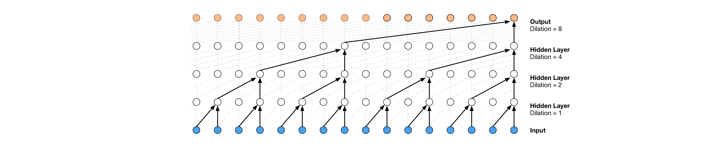
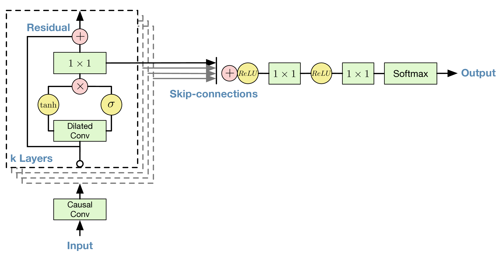

# Efficient Causal Convolutions for Time-Series Forecasting

[](https://codecov.io/gh/stefanocampanella/devtools_scicomp_project_2025)

In this project, an autoregressive model (ARM) using causal convolutions has been implemented. The purpose is to showcase the usage of software engineering practices (e.g. unit testing), development tools (e.g. git), and libraries commonly used in deep-learning (e.g. the JAX AI stack).

The code is a complete rewrite in JAX/Haiku of one of the assignments given at the [2024th edition of the Generative Modelling Summer School](https://gemss.ai/2024/) at the Eindhoven TUe. 

## Introduction

An ARM is a likelihood-based deep generative model that, for example, could be parameterized by causal convolutional neural networks or causal transformers. Here, we focus on the former. The approach of parameterizing ARMs with causal convolutions was utilized in multiple papers, e.g.:
- [Van den Oord, Aaron, et al. "Conditional image generation with pixelcnn decoders." NeurIPS 29 (2016).](https://proceedings.neurips.cc/paper/6527-conditional-image-generation-with-pixelcnn-decoders)
- [Oord, Aaron van den, et al. "Wavenet: A generative model for raw audio." arXiv preprint arXiv:1609.03499 (2016).](https://arxiv.org/abs/1609.03499)

ARMs are probabilistic models that utilize factorization of joint distribution in the following manner:

```math
p(x) = \prod_{d=1}^{D - 1} p(x_d | x_{1:d-1}) \; p(x_0).
```

Then the log-likelihood function is then the following:

```math
\ln p(x) = \sum_{d=1}^{D - 1} \ln p(x_d | x_{1:d-1}) + p(x_0).
```

This is very convenient because we *only* need to model conditionals. One possible way of doing that is using **causal convolutions**. Then, we can use a convolutional neural network that predicts the parameters of the conditionals in a single forward run. The challenge, though, is how to allow learning long-range dependencies (a *long-term memory*), which can be solved by stacking dilated convolutions.

The experiments performed in this repo will be performed on the **sequential MNIST** dataset.

## Causal Convolutions

One dimensional causal convolutions are just regular convolutions on an array of values $(x_0, \dots, x_{D-1})$ where 
the $k$-th element of the result dependent only on the previous $(x_0, \dots, x_{k - 1})$ values.



This means that kernel convolutions with weights $(w_0, \dots, w_{n - 1})$ are not centered around the current value as usually do, i.e. the causal convolution operator $C$ is such that

```math
C(x, w)_k = \sum^{n - 1}_{i = 0} w_{i} x_{k - n + i + (1 - A)} \; ,
```

where $A = 1$ for the case of dependency on the current token or $A = 0$ if not. 

In the implementation this can be obtained by using carefully chosen padding and slicing of input and output arrays. Furthermore, in the case of dilation, one must take that into account when padding.

## Dataset and Probability Distribution Parametrization

The MNIST dataset contains $28\times28$ images of handwritten digits, where the value of each pixel is quantized to 
fixed brightness levels in the range $\{0, \cdots, 255 \}$. 

Hence, a natural choice is to use a categorical distribution for each pixel $x_d$, i.e., a probability mass function $\theta_{dx}$ for $j$ taking values in $\{0, \cdots, 255\}$.

Then the log-probability of a sequence $(x_0, \dots, x_{D - 1})$, after taking the factorization of the joint distribution using the product rule into account and up to a constant, will be

```math
\log{p} = 
\sum^{D - 1}_{d = 0} \log{\left(\theta_{d x_d}\right)} = 
\sum^{D - 1}_{d = 0} \sum^{255}_{i = 0} \delta_{i x_d} \log{(\theta_{d i})}
```

where $\delta_{i j}$ is the Kronecker delta.

After the repeated application of the product rule, the probabilities $\theta_{d i}$ are functions of the sampled values up to $x_{d - 1}$, i.e. $\theta_{d i} = \theta_{d i}\left(x_0, \cdots, x_{d - 1}\right)$. One can start from a fixed value for $x_0$, say $x_0 = 0$, and then sample $x_1$ according to prescribed categorical distribution, which can be sampled using `jax.random.categorical`, and so on.

## Network architecture

The network architecture used in this project is taken from [Oord, Aaron van den, et al. 2016](https://arxiv.org/abs/1609.03499), with minor changes. 



Apart from the use of causal convolutions, its main features are:

1. The use of gated activation functions.
2. The use of residuals and skip connections.
3. The stacking of convolutions blocks, each composed by convolution layers using exponentially increasing dilation rates (1, 2, 4, 8, and so on).

Also, the original architecture was already modeling the signal using categorical variables (discrete levels for each audio sample, here pixel). The major change introduced is the usage of an embedder, adding a trailing (channel) dimension, needed by convolution operations.

## Implementation

The project has been implemented using libraries from the [JAX AI stack](https://docs.jaxstack.ai/). These include `optax` for gradient processing and optimization, and `orbax-checkpoint` for checkpointing. The only exception is [`haiku`](https://dm-haiku.readthedocs.io/), which Google still supports, although discouraging its adoption for new projects. That being said, `haiku` is feature complete, stable, and, in the opinion of the author, rather elegant. 

Particular care has been devoted to performance, e.g., for the implementation of the sampler using the JAX primitive `jax.lax.scan` instead of loops. For unknown reasons, tentative implementations of the evaluation routine (computing the negative log likelihood of the validation set) using `jax.vmap` failed to jit-compile (and the current one leverages `jax.lax.scan`).

The training loop implements early stopping, and the negative log-likelihood of the validation set is logged on tensorboard using the torch wrapper `torch.utils.tensorboard`. Similarly, samples drawn from the model are plotted for each epoch.

The training script is available via a module script, and its command line interface is built using [`click`](https://click.palletsprojects.com/). Also, training is fully deterministic, thanks to explicit seeding. 

Future versions of the code should be implemented using [`grain`](https://google-grain.readthedocs.io/), which, for example, would allow handling a pseudo-random number generator state and checkpointing it with `orbax`.

## Results

The model has been trained using CINECA Leonardo supercomputer (some utility scripts to set up and work with the environment are located under `leonardo`). The tensorboard training logs are located under `runs`, and some generated samples are shown in `notebooks/generate_samples.py`.